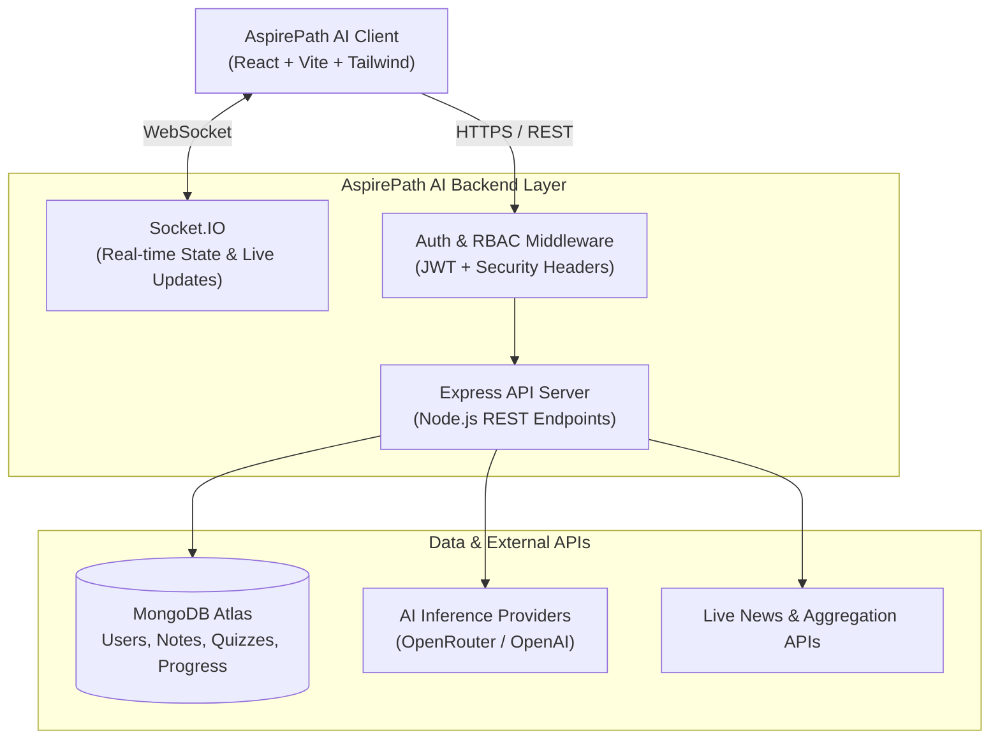

<div align="center">

# 🚀 AspirePath AI

### *AI-Powered Career Advancement & Interactive Developer Learning Platform*

[](https://react.dev/)
[](https://nodejs.org/)
[](https://www.mongodb.com/)
[](https://tailwindcss.com/)

[Live Demo](https://aspirepath-ai.vercel.app) • [Architecture](#-system-architecture) • [Features](#-key-platform-features) • [Getting Started](#-getting-started)

---

</div>

## 📖 Overview

**AspirePath AI** is an all-in-one, intelligent career preparation and developer education platform. It combines interactive learning modules, AI-powered skill assessments, smart ATS resume optimization, coding challenge environments, and personalized learning roadmaps to guide software engineers from fundamentals to career readiness.

Whether preparing for technical interviews, assessing DSA competencies, or analyzing resume alignment with industry job postings, AspirePath AI provides the automated tooling and structured pathways needed to accelerate technical growth.

---

## ✨ Key Platform Features

### 🤖 AI-Powered Intelligence
* **AI Skill Assessment Engine**: Automated evaluation of domain knowledge with real-time feedback, detailed performance metrics, and dynamic question generation.
* **Smart Study Buddy**: Integrated LLM chat assistant that helps clarify algorithmic concepts, debug code snippets, and explain complex software engineering topics.
* **AI Project Recommender**: Tailored software project suggestions based on developer proficiency, preferred tech stack, and target career paths.
* **Automated Notes Generator**: AI-assisted summarization that distills technical lectures and concepts into concise, revision-ready study notes.

### 💼 Career & Placement Preparation
* **ATS Resume Analyzer**: Real-time resume evaluation that scores keyword compatibility against software engineering job descriptions and provides targeted improvement suggestions.
* **Cover Letter Generator**: Dynamic, role-targeted cover letter creation customized to candidate qualifications and job requirements.
* **Company-Specific DSA Question Bank**: Curated collection of interview problems categorized by target companies, problem difficulty, and topic tags.
* **Interview Experience Archive**: Community-driven repository of real-world interview transcripts, tips, and compensation insights.

### 📚 Interactive Learning Hub
* **Structured Tracks**: Comprehensive modules covering **Data Structures & Algorithms (DSA)**, **MERN Full-Stack**, **Java Backend**, and **AI / Machine Learning Fundamentals**.
* **Live In-Browser Code Execution**: Interactive coding sandbox supporting multiple languages with real-time test case execution and error diagnostics.
* **Interactive Quiz Center**: Timed quizzes with immediate scoring, detailed solution breakdowns, and streak tracking.
* **Interactive Roadmaps**: Visual role-based and skill-based roadmaps covering Frontend, Backend, DevOps, Data Science, and Mobile development.
* **Comprehensive Tech Feed**: Curated live engineering news and updates from top developer ecosystems.

### 🛡️ Authentication & Role-Based Access
* Secure JWT token authentication with bcrypt password hashing.
* Optional Google OAuth integration.
* Role-based access control (RBAC) protecting administrative metrics, user management, and content moderation.

---

## 🏗️ System Architecture



---

## 🛠️ Tech Stack

| Layer | Technologies |
| :--- | :--- |
| **Frontend** | React 18, TypeScript, Vite, Tailwind CSS, Lucide React, React Icons, Motion |
| **Backend** | Node.js, Express.js, Socket.IO, Mongoose |
| **Database** | MongoDB Atlas |
| **Authentication** | JSON Web Tokens (JWT), Bcrypt.js, Optional Firebase Auth |
| **AI Integration** | OpenRouter API / OpenAI API |
| **Deployment** | Vercel (Frontend SPA), Render (Backend Web Service) |

---

## 📁 Project Structure

```
AspirePath-AI/
├── AspirePath-AI/
│   ├── Client/                     # React + Vite Frontend Application
│   │   ├── src/
│   │   │   ├── api/                # Axios API instance & service endpoints
│   │   │   ├── components/         # Reusable UI components & layouts
│   │   │   ├── contexts/           # Global, Auth, & Notification state
│   │   │   ├── pages/              # Dashboard, Coding, Learning Hub, Quizzes
│   │   │   └── utils/              # Client-side utilities & helpers
│   │   ├── vercel.json             # Vercel SPA routing configuration
│   │   └── package.json
│   │
│   └── Server/                     # Node.js + Express API Backend
│       ├── config/                 # Database connection & configurations
│       ├── controller/             # Business logic & request controllers
│       ├── middleware/             # Auth, validation, and sanitization
│       ├── model/                  # Mongoose schemas & data models
│       ├── routes/                 # Express API route declarations
│       ├── utils/                  # Mailer, logger, and AI utilities
│       ├── index.js                # Server entrypoint & middleware setup
│       └── package.json
│
├── render.yaml                     # Infrastructure-as-Code for Render
├── .gitignore                      # Environment variable & build protection
└── README.md                       # Project Documentation
```

---

## 🚀 Getting Started

### Prerequisites
* **Node.js**: v18.0.0 or higher
* **npm**: v9.0.0 or higher
* **MongoDB**: A running MongoDB Atlas cluster or local MongoDB instance

---

### Local Installation

1. **Clone the Repository**
   ```bash
   git clone https://github.com/snehareddy2112/AspirePath-AI.git
   cd AspirePath-AI
   ```

2. **Backend Setup**
   ```bash
   cd AspirePath-AI/Server
   npm install
   ```
   Create a `.env` file in `AspirePath-AI/Server/`:
   ```env
   PORT=5000
   MONGO_URI=mongodb://localhost:27017/aspirepathai
   JWT_SECRET=your_jwt_secret_key_minimum_32_characters
   FRONTEND_URL=http://localhost:5173
   NODE_ENV=development
   ```
   Start the backend development server:
   ```bash
   npm run dev
   ```

3. **Frontend Setup**
   Open a new terminal window:
   ```bash
   cd AspirePath-AI/Client
   npm install
   ```
   Create a `.env` file in `AspirePath-AI/Client/`:
   ```env
   VITE_API_URL=http://localhost:5000
   ```
   Start the frontend development server:
   ```bash
   npm run dev
   ```

4. **Access the Application**
   Navigate to `http://localhost:5173` in your browser.

---

## 🌐 Production Deployment

### Frontend (Vercel)
* **Root Directory**: `AspirePath-AI/Client`
* **Framework Preset**: `Vite`
* **Build Command**: `npm run build`
* **Output Directory**: `dist`
* **Environment Variables**:
  * `VITE_API_URL`: `https://your-backend-api.onrender.com`

### Backend (Render)
* **Root Directory**: `AspirePath-AI/Server`
* **Environment**: `Node`
* **Build Command**: `npm install`
* **Start Command**: `node index.js`
* **Environment Variables**:
  * `MONGO_URI`: `your_mongodb_atlas_connection_string`
  * `JWT_SECRET`: `your_production_jwt_secret`
  * `FRONTEND_URL`: `https://your-frontend.vercel.app`
  * `NODE_ENV`: `production`
